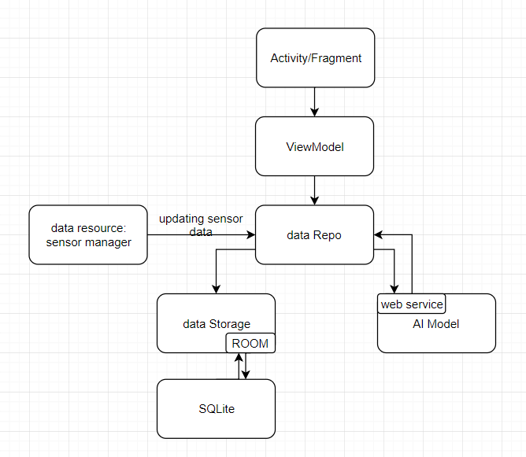

# Health Application

In this project, we will build a health advisor based on patterns your phone knows about you. We will build an Android App and utilize the AI kernel model developed in [Kaggle](https://www.kaggle.com/morrisb/what-does-your-smartphone-know-about-you) to analyse your daily activities, then give you health advices.

## System Design
  

## Iterations Plan

### Sprint 1
system design  
user story  

### Sprint 2
development environment set up  
CI/CD pipeline set up  
learning android development  

### Sprint 3
UI design  
data model design  
implement AI module  

### Sprint 4
implement&test android application  

## Team Members
* Leyang Shen
* Yuxuan Su